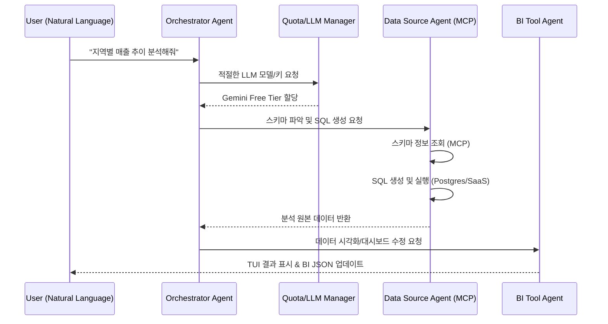

<h1 align="center">BI-Agent: The Frontier of Autonomous Business Intelligence</h1>

<p align="center">
  <strong>"데이터 오퍼레이션을 넘어, 비즈니스 인사이트의 자율화를 설계하는 아키텍트"</strong><br />
  BI-Agent는 단순한 대시보드 도구를 넘어, 기업의 데이터 자산을 스스로 탐색하고<br />
  <strong>차세대 의사결정 시스템(Autonomous BI)</strong>을 위한 완벽한 지능형 오케스트레이션을 제공합니다.
</p>

<p align="center">
  
  
  
  
</p>

---

## 🏛️ Comprehensive Solutions

BI-Agent는 데이터 분석가의 반복적인 작업에서 해방시키고, 비즈니스 가치 창출에 집중할 수 있도록 돕는 세 가지 핵심 솔루션을 제공합니다.

### 🧠 Autonomous Intelligence (The Brain)

**자율적인 사고로 데이터의 의미를 해석합니다.**

* **Multi-Agent Orchestration**: Orchestrator, Data Source, BI Tool Agent가 유기적으로 협업하여 "지난달 매출 하락 원인을 분석하고 대시보드에 반영해줘"와 같은 추상적인 요청을 구체적인 실행 단계로 분해합니다.
* **Self-Healing SQL Engine**: 데이터의 스키마와 관계를 스스로 학습하며, 쿼리 실행 중 오류가 발생하면 LLM이 오류 메시지를 분석해 스스로 정정(Self-Correction)하여 최종 결과를 도출합니다.
* **Zero-Cost Strategy**: Gemini Free Tier와 로컬 Ollama를 지능적으로 병용하는 `Quota Manager`를 통해, 기업의 인프라 비용 부담 없이 최신 AI의 지능을 업무에 즉시 도입할 수 있습니다.

### 🔌 Intelligent Connectivity (The Bridge)

**경계 없는 데이터 연동으로 파편화된 정보를 통합합니다.**

* **Unified MCP Protocol**: Model Context Protocol(MCP)을 기반으로 설계되어, 로컬 DB(Postgres, MySQL)부터 클라우드 SaaS(Snowflake, BigQuery), 그리고 S3 내의 비정형 데이터까지 단일한 인터페이스로 연결합니다.
* **Universal Context**: 모든 데이터 소스의 메타데이터와 스키마를 하나의 지능형 컨텍스트로 관리하여, 에이전트가 어떤 데이터 소스에서 어떤 정보를 가져와야 할지 스스로 판단하게 합니다.

### 📟 Fluid Interface (The Experience)

**터미널 환경에서 가장 세련된 분석 경험을 제공합니다.**

* **Premium TUI (Terminal UI)**: `rich` 라이브러리를 극대화하여 구현된 고품질 터미널 UI를 통해, 에이전트의 사고 과정(Chain of Thought)과 데이터 처리 상태를 실시간으로 시각화합니다.
* **Workflow Automation**: 복잡한 반복 업무를 위해 에이전트가 직접 **Apache Airflow DAG**를 설계하고 생성하는 기능(PoC)을 제공하여, 분석의 결과가 곧바로 운영 파이프라인으로 연결됩니다.

---

## 🏗️ System Lifecycle

BI-Agent는 사용자 요청부터 결과 도출까지 다음의 지능형 사이클을 반복합니다.



---

## 🧐 Why BI-Agent?

데이터가 넘쳐나는 시대, 분석가의 가치는 **'데이터를 뽑는 것'**이 아니라 **'데이터를 어떻게 비즈니스 무기로 바꿀 것인가'**에 있습니다.

* **Insight over Operation**: 단순 쿼리 작성과 데이터 추출은 Agent에게 맡기고, 분석가는 비즈니스 액션 아이템 도출에 집중합니다.
* **Safe-Guard Quota**: 'Quota Manager'가 사용자의 지갑을 보호하며, 비용 효율적인 인공지능 활용을 보장합니다.
* **Future-Proof**: MCP 프로토콜을 준수하므로 Cursor, Claude Desktop 등 미래의 모든 AI 도구들과 완벽하게 호환됩니다.

---

## 🚦 Getting Started (The Developer's Journey)

### 1단계: 환경 준비 (Setup)
- Python 3.10+, Node.js 18+가 설치되어 있어야 합니다.
- `.env.example`을 참고하여 `.env` 파일을 생성하고 Gemini API 키를 입력하세요.

### 2단계: 설치 및 실행 (Go Live)
```bash
# 1. 의존성 설치
pip install -r backend/requirements.txt
npm install

# 2. TUI 실행
python backend/orchestrator/tui_interface.py
```

### 3단계: AI 협업 시작 (Analyze)
- TUI 상에서 `connections`를 확인하고, 자유롭게 질문하세요.
- 에이전트가 보여주는 사고 과정을 감상하며 데이터 인사이트를 확인하세요.

---

## 🛠️ Technical Excellence

| Layer | Technologies |
| :--- | :--- |
| **Intelligence** | LangGraph, Gemini 2.0 Flash, Ollama, PydanticAI |
| **Connectivity** | **Model Context Protocol (MCP)**, Node.js, npx |
| **Interface** | **TUI (Rich)**, CLI Tooling |
| **Data Engine** | Snowflake, BigQuery, S3, Postgres, MySQL, DuckDB |
| **Automation** | Apache Airflow, Python venv isolation |

---

## 📖 Related Documents

* [**PLAN.md**](./docs/PLAN.md): 시스템 설계 및 최종 로드맵
* [**TODO.md**](./docs/TODO.md): 단계별 구현 태스크 및 상태
* [**USER_GUIDE.md**](./docs/USER_GUIDE.md): 상세 기능 활용 가이드

---

Copyright © 2026 BI-Agent Team. All rights reserved.
