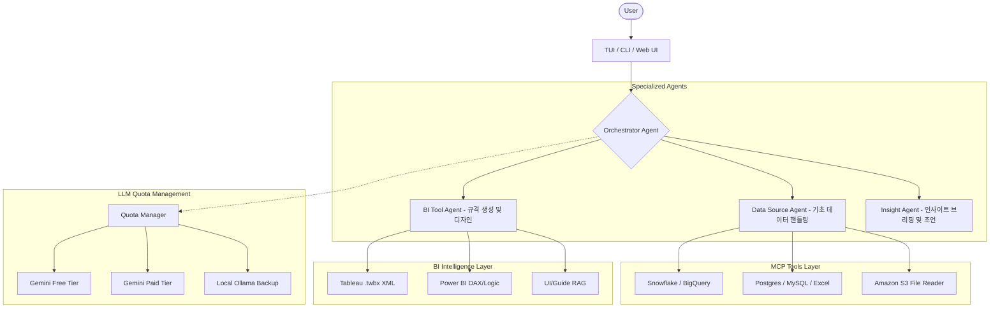

# BI-Agent 시스템 고도화 및 구현 계획 (Roadmap)

## 1. 프로젝트 개요

### 목표
**"DB 데이터를 분석하여 자사 BI 솔루션 메타데이터를 자동 생성하는 AI Agent"**
특정 DB에서 데이터를 추출하고, '데이터 분석 엔진'을 통해 인사이트를 발굴한 뒤, 이를 자사 BI 솔루션이 즉시 사용할 수 있는 메타데이터 파일로 변환하는 것을 목표로 합니다.

### 핵심 가치 (Co-pilot Philosophy)
- **High Efficiency**: 분석가 1인이 2~3인분의 성과를 낼 수 있도록 반복적/기술적 업무 자동화.
- **Analyst-Centric**: 에이전트는 '지능형 조수'이며, 최종 의사결정은 분석가의 전략적 판단에 따름.
- **Synergy Funnel**: 데이터 중노동은 에이전트가, 창의적 통찰은 분석가가 담당하는 협업 프로세스.
- **Universal Connectivity**: MCP를 통한 원활한 데이터 공급 및 자사 BI 메타데이터 최적화.

---

## 2. 시스템 아키텍처

### 2.1 Multi-Agent & Interface 구조



### 2.2 기술 스택
- **Backend / Agent**: Python (LangGraph, PydanticAI, pandas)
- **Protocol**: Model Context Protocol (MCP) - Node.js 기반 서버 레이어
- **LLM Provider**: Google Gemini (Main), Ollama (Local/Air-gap backup)
- **Interface**: **TUI (Rich/Textual)**, CLI (npx global 지원), React (Future)
- **Data & Ops**: Snowflake, BigQuery, S3, PostgreSQL, MySQL, Apache Airflow

---

## 3. 구현 단계 (Phases)

### Phase 0: 준비 및 진입 경험 (Completed)
- [x] **Pre-flight Check**: TUI 진입 전 LLM API Key 및 필수 환경 선검증 로직 구축
- [x] **Entrance Hall**: 환경 검사 통과 후 로고, 시스템 상태, 가이드가 포함된 홈 화면 구현
- [x] **Smart Quota & Zero-Billing**: Gemini, Claude, OpenAI 통합 트래킹 및 과금 방지 로직 (Phase 0+ 완료)
- [x] **Skills & Config**: 초기 프로젝트 설정 및 에이전트 기술(Skills) 활성화 상태 관리

### Phase 1: 기반 재구축 (In-Progress)
- [ ] **Collaborative Core**: 분석가와 에이전트의 '대화형 협업'을 가능하게 하는 기초 오케스트레이터 재설계
- [ ] **Protocol Optimization**: 에이전트 간의 정보 교환 규격(Context Passing)을 분석가 개입이 용이하도록 표준화
- [x] **Security & Key Management**: `auth_manager` 및 `quota_manager` 안정화 및 한글 가이드 내재화 (완료)
- [ ] **Unified Logging**: 분석가가 에이전트의 '생각'을 실시간으로 추적할 수 있는 CoT(Chain of Thought) 로깅 기초 구축

### Phase 2: 기능 확장 및 TUI 도입 (Completed)
- [x] Excel 데이터 소스 지원 (`excel-mcp-server`)
- [x] **TUI (Terminal UI) 프로토타입** 구현 (`rich` 라이브러리 활용)
- [x] Docker 기반 MySQL 테스트 환경 최적화 및 연동 검증
- [x] `.env.example` 및 상세 가이드 문서화 (`docs/SETUP_GUIDE.md`)
- [x] 프로젝트 규칙(`agent-guide-lines.md`) 수립 및 버전 관리 안정화 (0.1.0)
- [x] GitHub Actions OIDC 기반 PyPI 배포 자동화 구축

### Phase 3: [MVP] 자사 BI 메타데이터 생성 (In-Progress)
> **비전**: 분석가의 시간을 벌어주는 지능형 코파일럿 시스템 구축
> **협업 퍼널 (Analysis Synergy Funnel)**:
> 1.  **진입**: `bi-agent` 호출 (분석가)
> 2.  **연결**: 데이터 소스 지정 (분석가 - 에이전트 대행)
> 3.  **탐색/분석**: 스키마 파악 및 프로파일링 자동 수행 (에이전트)
> 4.  **브리핑**: 데이터 특징 및 KPI 추천 보고 (에이전트 - **한국어**)
> 5.  **의사결정**: 메인 지표 및 디자인 테마 선택 (분석가)
> 6.  **생성**: `suwon_pop.json` 기반 초안 조립 (에이전트)
> 7.  **감수**: 최종 결과물 리뷰 및 미세 조정 (분석가)
> 8.  **완성**: 대시보드 배포 및 분석 종료

- **데이터 연동 및 분석 (T15/T10)**:
  - [x] DB 데이터 로드 및 프로파일링 엔진 구축 (완료)
  - [ ] 자연어 인터랙션을 통한 핵심 지표(KPI) 및 피처 확정 로직
- **자사 메타 Generator (T16)**:
  - [ ] **Schema Engine**: `suwon_pop.json` 규격에 맞춘 JSON 생성기 개발
    - `connector`: DB 연결 정보 자동 매핑
    - `datamodel`: 분석 쿼리 및 필드 별칭(Alias) 정의
    - `report`: 컴포넌트(Label, Rect, Table 등) 배치 및 스타일 적용
- **디자인 및 스타일링 (T20)**:
  - [ ] `BI_VISUAL_DESIGNER` 스킬 기반 테마(색상, 폰트) 적용 로직

### Phase 4: 외산 BI(Tableau/PBI) 및 도구 확장 (Planning)
- **BI Metadata Intelligence**:
  - [x] **Tableau Meta JSON MVP**: 기본적인 XML → JSON 변환 완료 (이전 성과)
  - [ ] **Power BI Logic (DAX)**: 고도화된 DAX 계산식 및 M 문법 자동 생성 지원

### Phase 4: 패키징 및 글로벌 배포 (Planning)
- **Distribution**:
  - [ ] **NPM Global 패키지 배포**: `npm install -g bi-agent` 지원
  - [ ] 경량화 전략: Node.js 래퍼 + 동적 Python 엔진 설치 방식 적용
- **Production Readiness**:
  - [ ] 에러 핸들링 고도화 (Self-healing logic 강화)
  - [ ] 보안 강화 (DB Credential 관리, API Key 암호화)
  - [ ] 상세 사용자 가이드 및 API 문서 완성

### Phase 5: 데이터 분석 엔진 (Post-MVP Priority) 🌟
> **핵심 가치**: BI를 "단순히" 구현하는 것이 아니라 "잘" 구현하기 위한 지능형 분석 레이어

- **목표**: 데이터 소스와 시각화 생성 사이에 "분석 단계"를 추가하여 더 나은 BI 결과물 산출
- **파이프라인 전환**:
  ```
  [현재] 데이터 소스 → 메타데이터 추출 → 시각화 생성
  [목표] 데이터 소스 → [데이터 프로파일링 & 인사이트 발굴] → 최적화된 시각화 제안 → 메타데이터 생성
  ```
- **핵심 기능**:
  - [ ] **데이터 프로파일링**: 컬럼 타입, 분포, 결측치, 이상치 자동 분석
  - [ ] **인사이트 발굴**: 트렌드, 상관관계, 클러스터링 자동 탐지
  - [ ] **시각화 추천**: 데이터 특성에 맞는 최적 차트 타입 자동 제안
  - [ ] **스토리텔링**: 분석 결과를 사용자에게 자연어로 설명


## 4. 핵심 컴포넌트 상세

### Quota Manager (과금 방지 & Multi-LLM)

- **목표**: 0원에 수렴하는 운영 비용 관리 및 구독 혜택 극대화
- **기능**:
  - `GEMINI`, `CLAUDE`, `OPENAI` API 할당량을 실시간 추적
  - 무료 티어 및 로컬(Ollama) 모델을 포함한 **Zero-Billing** 체인 구축
  - 사용자가 보유한 모든 유료 구독을 우선 소진 후 안전하게 Fallback

### TUI Interface (경험의 혁신)
- **목표**: 터미널 기반의 전문적인 분석 워크스페이스 제공
- **기능**:
  - Agent의 사고 과정(Chain of Thought) 시각화
  - 데이터 테이블 프리뷰 및 분석 결과 실시간 스트리밍
  - 한글 입력 및 다국어 지원 최적화

---

## 5. 리스크 및 대응 전략

| 리스크 | 영향도 | 대응 방안 |
|:---:|:---:|:--- |
| **과금 위험** | 높음 | Quota Manager를 통한 임계치 설정 및 차단 |
| **데이터 보안** | 높음 | 로컬 DB 접근 권한 분리 및 환경 변수 암호화 |
| **복잡한 쿼리 오류** | 중간 | Self-healing (오류 로그 분석 후 재시도) 로직 적용 |
| **설치 편의성** | 낮음 | npx 및 글로벌 CLI 배포를 통한 원클릭 환경 구축 |

---

## 6. 예상 타임라인 (Re-evaluated)

- **1~2주차**: (완료) 아키텍처 수립 및 로컬 DB 연동
- **3~4주차**: (현재) TUI 고도화, 과금 관리 로직, SaaS 연동
- **5~6주차**: Airflow PoC 및 BI JSON 수정 자동화
- **7주차**: 패키징 및 최종 검증

---
Copyright © 2026 BI-Agent Team. All rights reserved.
