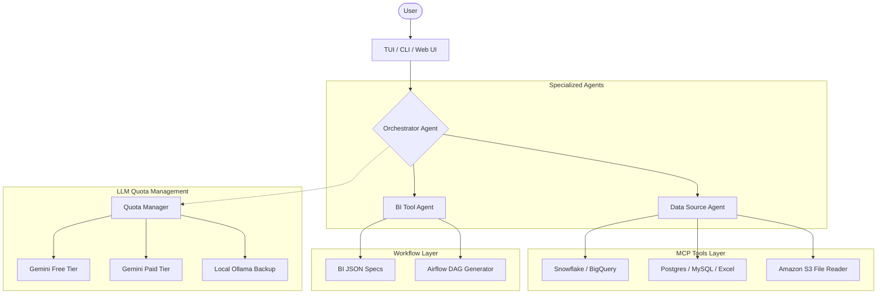

# BI-Agent 시스템 고도화 및 구현 계획 (Roadmap)

## 1. 프로젝트 개요

### 목표
**"데이터 오퍼레이션을 넘어, 비즈니스 인사이트의 자율화를 실현하는 AI Agent"**
사용자가 자연어로 요청하면, Agent가 다양한 데이터 소스(SaaS, DB, File)를 탐색하고, 복잡한 비즈니스 로직을 처리하며, BI 대시보드 수정 및 워크플로우 자동화(Airflow)까지 수행하는 전과정 자율형 시스템을 구축합니다.

### 핵심 가치
- **Autonomous Intelligence**: 스스로 생각하고 오류를 교정하는 멀티 에이전트 시스템.
- **Cost Sovereignty (Zero-Cost)**: 무료/유료 LLM 티어를 지능적으로 관리하여 운영 비용 최소화.
- **Universal Connectivity**: MCP 프로토콜을 통한 무한한 데이터 소스 확장성.
- **Professional Experience**: 분석가에게 친숙한 고품질 TUI(CLI) 중심 인터페이스.

---

## 2. 시스템 아키텍처

### 2.1 Multi-Agent & Interface 구조

### 2.2 기술 스택
- **Backend / Agent**: Python (LangGraph, PydanticAI, pandas)
- **Protocol**: Model Context Protocol (MCP) - Node.js 기반 서버 레이어
- **LLM Provider**: Google Gemini (Main), Ollama (Local/Air-gap backup)
- **Interface**: **TUI (Rich/Textual)**, CLI (npx global 지원), React (Future)
- **Data & Ops**: Snowflake, BigQuery, S3, PostgreSQL, MySQL, Apache Airflow

---

## 3. 구현 단계 (Phases)

### Phase 1: 기반 구축 (Completed)
- [x] 프로젝트 구조 및 환경 설정 (`venv`, `dotenv`)
- [x] 기본적인 멀티 에이전트 구조 및 Orchestrator 설계
- [x] PostgreSQL/MySQL MCP 서버 연동 및 기본 쿼리 테스트
- [x] Gemini API 연동 및 Quota 관리 기초 구현

### Phase 2: 기능 확장 및 TUI 도입 (Completed/Finalizing)
- [x] Excel 데이터 소스 지원 (`excel-mcp-server`)
- [x] **TUI (Terminal UI) 프로토타입** 구현 (`rich` 라이브러리 활용)
- [x] Docker 기반 MySQL 테스트 환경 최적화 및 연동 검증
- [x] `.env.example` 및 가이드라인 문서화

### Phase 3: 기능 고도화 및 지능형 오케스트레이션 (In-Progress)
- **SaaS & Cloud Connectivity**:
  - [ ] Snowflake 및 BigQuery 전용 커넥터 연동
  - [ ] Amazon S3 버킷 내 파일(CSV/Parquet) 직접 분석 기능
- **Billing Sovereignty (과금 제어)**:
  - [ ] `Quota Manager` 고도화: 무료 키 소진 시 유료 키/Ollama 자동 로테이션
  - [ ] 트큰 사용량 모니터링 및 실시간 비용 리포팅
- **Workflow Automation**:
  - [ ] **Airflow PoC**: 분석 결과를 바탕으로 스케줄링 가능한 Airflow DAG 자동 생성
- **Agent Intelligence**:
  - [ ] 비즈니스 도메인 지식 주입 및 Few-shot SQL 생성 최적화
  - [ ] BI JSON 명세서의 복잡한 시각화 로직 자동 수정

### Phase 4: 패키징 및 글로벌 배포 (Planning)
- **Distribution**:
  - [ ] **NPM Global 패키지 배포**: `npm install -g bi-agent` 지원
  - [ ] 경량화 전략: Node.js 래퍼 + 동적 Python 엔진 설치 방식 적용
- **Production Readiness**:
  - [ ] 에러 핸들링 고도화 (Self-healing logic 강화)
  - [ ] 보안 강화 (DB Credential 관리, API Key 암호화)
  - [ ] 상세 사용자 가이드 및 API 문서 완성

---

## 4. 핵심 컴포넌트 상세

### Quota Manager (과금 방지)
- **목표**: 0원에 수렴하는 운영 비용 관리
- **기능**:
  - `GEMINI_API_KEYS`의 할당량을 실시간 추적
  - 무료 티어 키들을 순환(Rotation)시키며 활용 극대화
  - 모든 API 키 소진 시 로컬 Ollama 모델로 자동 Failover

### TUI Interface (경험의 혁신)
- **목표**: 터미널 기반의 전문적인 분석 워크스페이스 제공
- **기능**:
  - Agent의 사고 과정(Chain of Thought) 시각화
  - 데이터 테이블 프리뷰 및 분석 결과 실시간 스트리밍
  - 한글 입력 및 다국어 지원 최적화

---

## 5. 리스크 및 대응 전략

| 리스크 | 영향도 | 대응 방안 |
|:---:|:---:|:--- |
| **과금 위험** | 높음 | Quota Manager를 통한 임계치 설정 및 차단 |
| **데이터 보안** | 높음 | 로컬 DB 접근 권한 분리 및 환경 변수 암호화 |
| **복잡한 쿼리 오류** | 중간 | Self-healing (오류 로그 분석 후 재시도) 로직 적용 |
| **설치 편의성** | 낮음 | npx 및 글로벌 CLI 배포를 통한 원클릭 환경 구축 |

---

## 6. 예상 타임라인 (Re-evaluated)

- **1~2주차**: (완료) 아키텍처 수립 및 로컬 DB 연동
- **3~4주차**: (현재) TUI 고도화, 과금 관리 로직, SaaS 연동
- **5~6주차**: Airflow PoC 및 BI JSON 수정 자동화
- **7주차**: 패키징 및 최종 검증

---
Copyright © 2026 BI-Agent Team. All rights reserved.
