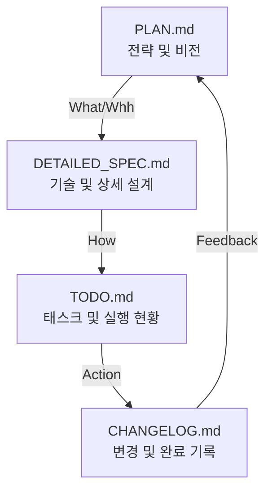

# BI-Agent Documentation System 📚

이 디렉토리는 BI-Agent 프로젝트의 전략, 설계, 실행 및 기록을 관리하는 시스템입니다. 모든 문서는 유기적으로 연결되어 있으며, 아래의 **[4-단계 문서 순환 체계]**를 따릅니다.

---

## 🔄 4-단계 문서 순환 체계 (Document Lifecycle)

프로젝트의 진행 상태에 따라 아래 순서로 문서를 참조하고 업데이트하세요.

| 문서명 | 역할 | 업데이트 시점 |
| :--- | :--- | :--- |
| [**PLAN.md**](./core/PLAN.md) | **전략 (Strategy)**: 마일스톤 및 로드맵 | 새로운 Phase 시작 시 |
| [**DETAILED_SPEC.md**](./core/DETAILED_SPEC.md) | **설계 (Design)**: 기술 구조 및 프롬프트 명세 | 세부 로직 확정 시 |
| [**TODO.md**](./core/TODO.md) | **실행 (Action)**: 현재 진행 태스크 체크리스트 | 매일 작업 시작/종료 시 |
| [**CHANGELOG.md**](./core/CHANGELOG.md) | **기록 (History)**: 완료된 변경 사항 이력 | 주요 기능 완성 및 배포 시 |

---

## 📁 디렉토리 구조

- [**core/**](./core/) : 프로젝트의 핵심 심장부 (전략, 설계, 실행, 기록)
- [**guides/**](./guides/) : 설치 및 사용자 매뉴얼
- [**mcp/**](./mcp/) : Model Context Protocol 기술 가이드

---

## 💡 관리 팁
1. **ID 동기화**: `PLAN.md`에 정의된 `Step 번호`(예: Step 6)를 모든 문서에서 공통 키워드로 사용하세요.
2. **선형적 흐름**: 새로운 기능을 만들 때는 `PLAN` -> `SPEC` -> `TODO` 순서로 생각하고, 마무리는 `CHANGELOG`로 하세요.
3. **최신성 유지**: `TODO.md`는 항상 현재의 실제 상태를 반영해야 합니다.

Copyright © 2026 BI-Agent Team.
