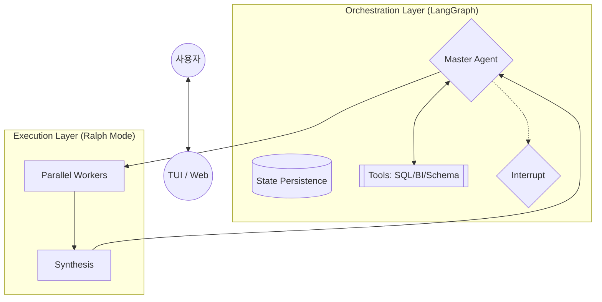

# [Architecture] Next-Gen BI-Agent Orchestrator

이 문서는 BI-Agent의 차세대 아키텍처인 **Agentic ReAct Loop**, **Ralph Swarm**, **HITL(Human-in-the-Loop)** 통합 구현을 위한 공식 기획 문서입니다.

## 1. 개요 및 요구사항
기존의 고정된 라우팅 방식을 넘어, LLM이 자율적으로 판단하고 병렬로 협업하며 인간의 승인을 거치는 유연한 지능형 시스템을 구축합니다.

### 핵심 기능
- **ReAct Loop**: 스스로 판단하고 도구를 선택해 실행하는 자율성
- **Ralph Swarm**: 수십 개의 분석 시나리오를 동시 처리하는 초병렬성
- **HITL**: 주요 결정 지점에서 사용자 승인을 대기하는 안전성

## 2. 아키텍처 설계

## 3. 구현 로드맵 (Roadmap)

### PHASE 1: 기초 공사 (Foundation)
- `LLMProvider` -> LangChain `ChatModel` 어댑터 구축
- SQLite 기반 `Checkpointer` 설정

### PHASE 2: 에이전틱 전환 (Agentification)
- ReAct 루프 프롬프트 및 `StateGraph` 구현
- HITL 인터럽트 로직 및 UI 연동

### PHASE 3: Ralph 모드 완성 (Optimization)
- 병렬 스웜 분석 엔진 가동
- 전역적인 쿼터 및 리소스 관리 시스템 구축

---
**Last Updated:** 2026-02-19
**Status:** Approved for Implementation
